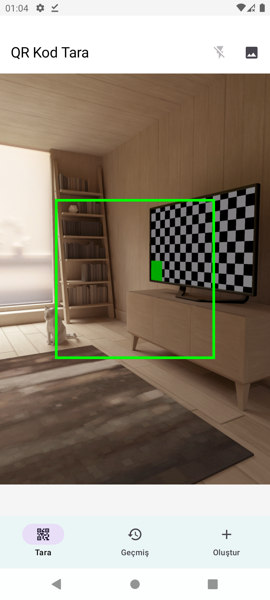
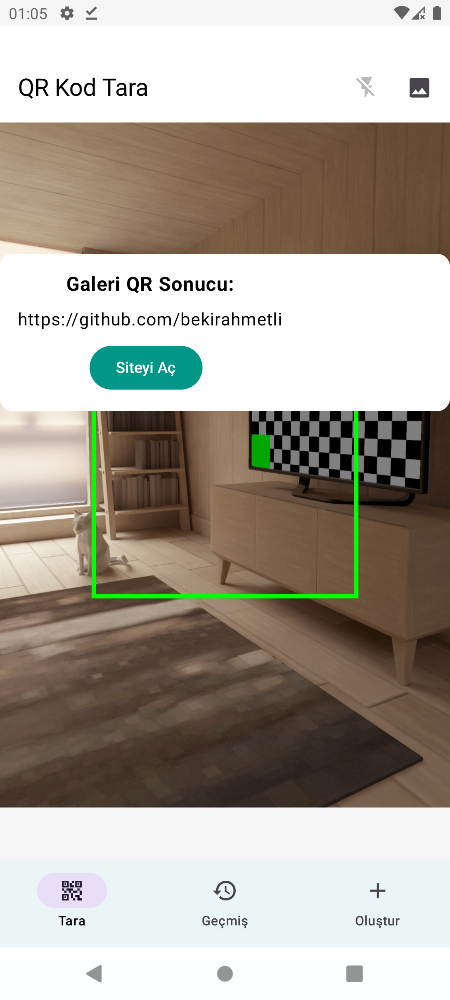
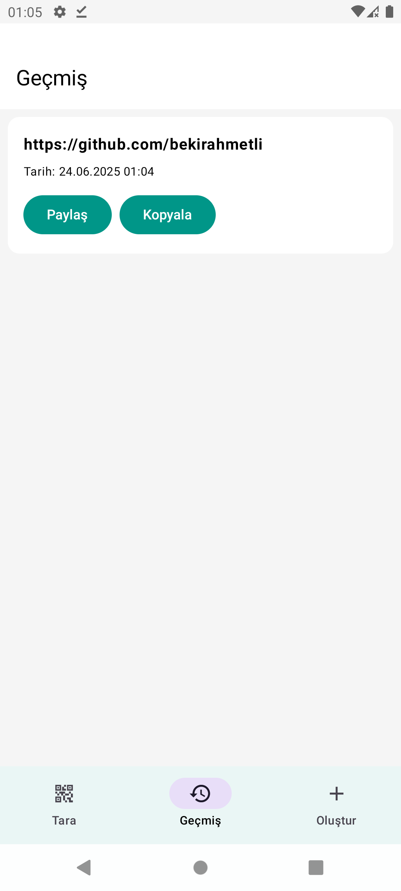
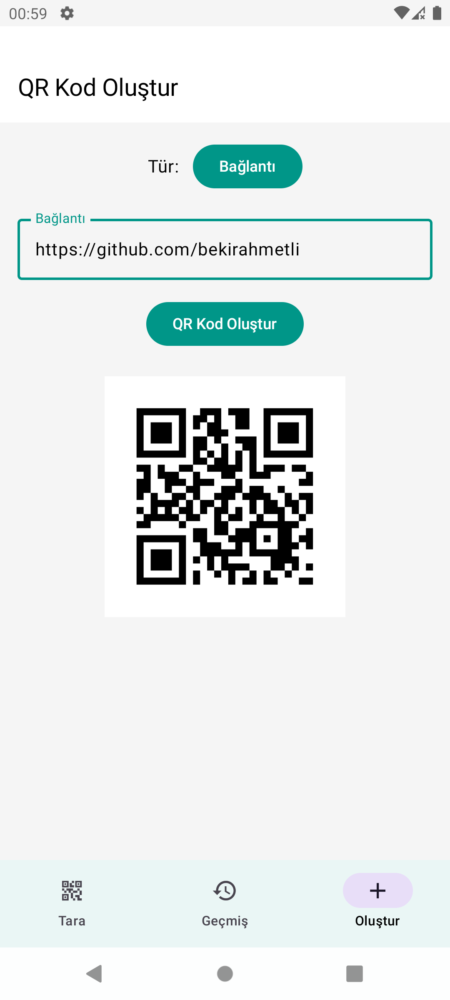

# 📱 Kotlin QR Code Scanner

A modern, fast, and user-friendly QR code scanner and generator app developed with Kotlin. Packed with features like real-time scanning, gallery selection, history tracking, and QR code creation.

---

## 🚀 Features

### 🔍 QR Code Scanning
- Real-time camera scanning
- Scan QR codes from gallery images
- Auto-detect content types (URLs, text, email, phone, Wi-Fi)

### 💡 Extra Features
- Scan history with timestamp and content preview
- Share, copy, or open scanned content
- Create QR codes from text, URL, phone, Wi-Fi info

### ⚙️ Technical Details
- Uses Jetpack libraries (CameraX, ViewModel, LiveData)
- Optional integration with ZXing or Google ML Kit

---

## 📸 App Screenshots

| Home | Scanning | History |
|------|----------|---------|
|  |  |  |

| Generator |
|----------|

---
